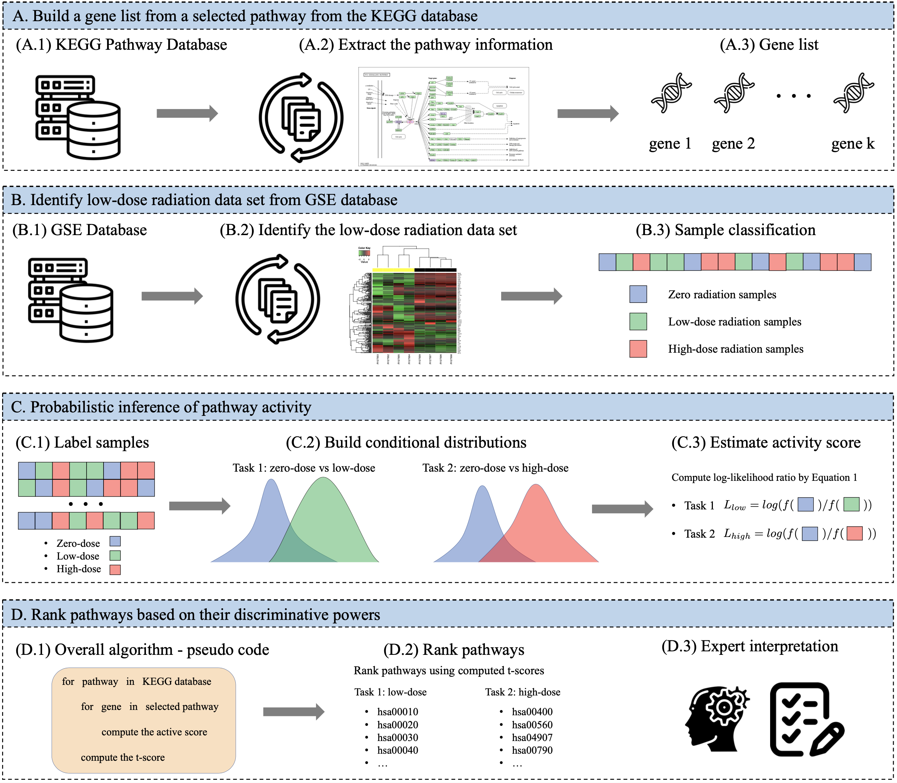

# pathway_analysis
## Abstract
There are various sources of ionizing radiation exposure, where medical exposure for radiation therapy or diagnosis is the most common human-made source. Understanding how gene expression is modulated after ionizing radiation exposure and investigating the presence of any dose-dependent gene expression patterns have broad implications for health risks from radiotherapy, medical radiation diagnostic procedures, as well as other environmental exposure. In this paper, we perform a comprehensive pathway-based analysis of gene expression profiles in response to low-dose radiation exposure, in order to examine the potential mechanism of gene regulation underlying such responses. To accomplish this goal, we employ a statistical framework to determine whether a specific group of genes belonging to a known pathway display coordinated expression patterns that are modulated in a manner consistent with the radiation level. Findings in our study suggest that there exist complex yet consistent signatures that reflect the molecular response to radiation exposure, which differ between low-dose and high-dose radiation.

## Overall Methodology
<p><p>

## Associated Papers
- Comprehensive analysis of gene expression profiles to radiation exposure reveals molecular signatures of low-dose radiation response [ [ArXiV](https://arxiv.org/abs/2301.01769) ] [ [2022 IEEE International Conference on Bioinformatics and Biomedicine (BIBM)](https://ieeexplore.ieee.org/abstract/document/9995607) ]
- Best poster award at 2022 Summer Symposium Adjourned Precision Medicine Applications in Radiation Oncology [ [CI4CC](https://www.ci4cc.org/2022-InPerson-society-symposium) ]

[Xihaier Luo](https://xihaier.github.io/), Sean McCorkle, Gilchan Park, Vanessa López-Marrero, Shinjae Yoo, Edward R Dougherty, Xiaoning Qian, Francis J Alexander, Byung-Jun Yoon


## Dependencies
- python 3
- matplotlib


## Installation

- Install the needed dependencies

- Clone this repo:

```
git clone https://github.com/Xihaier/pathway_analysis
```

## Citation

If you find this repo useful for your research, please consider to cite:

```latex
@inproceedings{luo2022comprehensive,
  title={Comprehensive analysis of gene expression profiles to radiation exposure reveals molecular signatures of low-dose radiation response},
  author={Luo, Xihaier and McCorkle, Sean and Park, Gilchan and L{\'o}pez-Marrero, Vanessa and Yoo, Shinjae and Dougherty, Edward R and Qian, Xiaoning and Alexander, Francis J and Yoon, Byung-Jun},
  booktitle={2022 IEEE International Conference on Bioinformatics and Biomedicine (BIBM)},
  pages={2366--2374},
  year={2022},
  organization={IEEE}
}
```

## Questions

For any questions or comments regarding this paper, please contact Xihaier Luo via [xluo@bnl.gov](mailto:xluo@bnl.gov).

